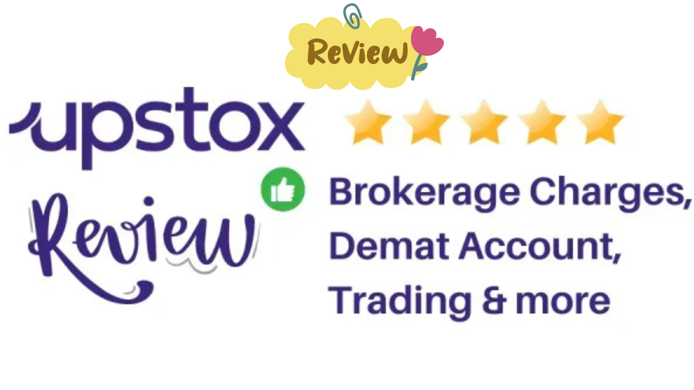
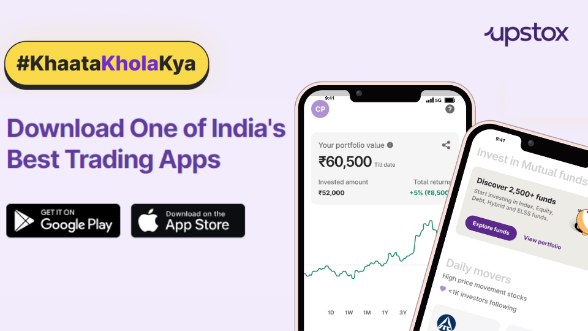
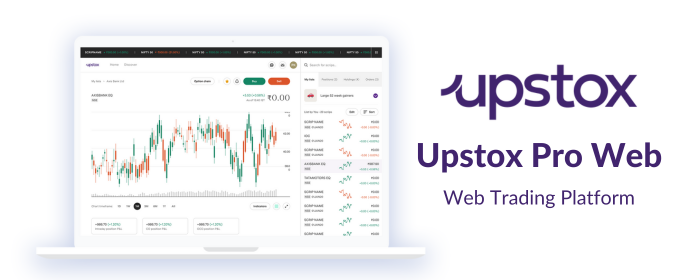
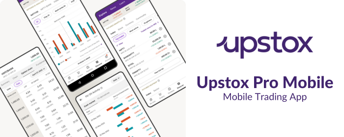

# Upstox Demat Account Review 2024: Brokerage Charges, Account Opening Process, Pros & Cons

---

## Introduction

Upstox, formerly known as RKSV Securities, is one of India's leading discount brokers. Backed by industry giants like Ratan Tata and Tiger Global Management, Upstox has quickly emerged as a trusted platform for millions of traders and investors. Whether you're new to investing or a seasoned trader, Upstox offers competitive brokerage rates, robust trading tools, and a user-friendly interface.

👉 [Open Your Free Upstox Account Now! 🚀](https://upstox.com/open-demat-account/?f=xMlY)

---

## Why Choose Upstox?

Upstox provides a platform to trade equities, commodities, F&O, currencies, IPOs, mutual funds, and even digital gold. Here are the standout features:

- **Free Account Opening:** No charges for opening a Demat account.
- **Low Brokerage Fees:** Flat ₹20 per order or 0.05%, whichever is lower.
- **Advanced Trading Tools:** Access to Upstox Pro Web and Mobile platforms with 100+ indicators.
- **Trust and Reliability:** Backed by over **1 crore investors and traders**.

👉 [Start Trading with Upstox 🚀](https://upstox.com/open-demat-account/?f=xMlY)

---

## Upstox Trading Platforms

### 1. **Pro Web Trading Platform**

The **Upstox Pro Web** platform is packed with features to make trading seamless:
- **100+ Indicators:** Tailored for professional-level trading.
- **Real-Time Data:** Extensive market tracking for confident decision-making.
- **Customizable Interface:** Built to suit your trading style.

### 2. **Pro Mobile App**

Trade on-the-go with the **Upstox Pro Mobile App**, available for both Android and iOS:
- **User-Friendly Design:** Perfect for beginners and pros alike.
- **Smart Features:** Includes watchlists, filters, and market updates.
- **Advanced Charting Tools:** Analyze trends with real-time data and technical indicators.

👉 [Experience World-Class Trading Platforms 🚀](https://upstox.com/open-demat-account/?f=xMlY)

---

## How to Open an Upstox Demat Account

Opening a Demat account with Upstox is quick and hassle-free. Follow these steps:

1. **Visit** the [Upstox Website](https://upstox.com/open-demat-account/?f=xMlY) or download the Upstox app.
2. Enter your **mobile number** and **email ID** for OTP verification.
3. Provide your **PAN number**, **date of birth**, and basic details.
4. Use **DigiLocker** to share Aadhaar details securely.
5. Upload necessary documents:
   - PAN Card
   - Aadhaar Card
   - Bank Details
   - Signature Photo
6. Complete **in-person verification** via video or selfie.
7. **E-Sign** the form and submit.

Your account will be activated within 24 hours!

👉 [Open Your Free Upstox Account Today 🚀](https://upstox.com/open-demat-account/?f=xMlY)

---

## Conclusion

Upstox offers a reliable, cost-effective trading experience for both beginners and seasoned investors. With no account opening fees, minimal brokerage charges, and state-of-the-art platforms, it stands out as one of the top brokers in India. Don't miss the opportunity to join over **1 crore satisfied users**!

👉 [Open Your Free Upstox Account Now! 🚀](https://upstox.com/open-demat-account/?f=xMlY)

---

### Disclaimer
This article is for informational purposes only and does not constitute financial advice. Please consult a financial advisor for personalized guidance.
